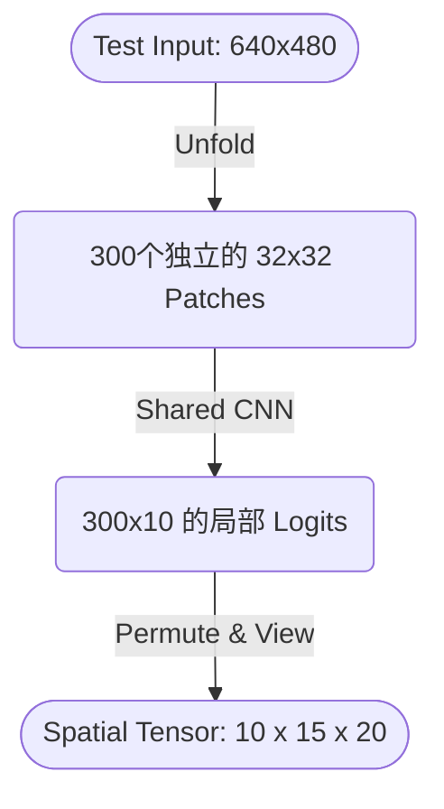

# 密集特征提取模型架构设计：从全局 HRNet 到局部 MIL-PatchCNN

**本文档旨在详细记录项目从原先的全局 HRNet (High-Resolution Net) 迁移到新设计的 Patch 级别的多示例学习卷积神经网络 (MIL-PatchCNN) 的动机、设计思路、物理直觉与核心架构。**

## 1. 问题背景：HRNet 为什么失效了？

在之前的模型中，系统采用预训练的 **HRNet-W18** 作为图像特征提取网络。然而在渲染并生成带有“真实焦距深度”的混合模糊图像 (Mixed-Blur Images) 时，其输出预期的模糊半径 (Expected Radius) 发生了全图坍缩：即使是严重失焦模糊的背景像素，也输出了与极其锐利的前景目标完全相同的值 (Radius ~ 0.1)。

### 1.1 感受野 (Receptive Field) 的污染
由于我们的目标是从“全局图像分类 (Image-level Regression)” 演进到 **“密集预测 / 语义景深映射 (Dense Prediction)”**。
虽然 HRNet 的输出特征图分辨率为 `15 x 20` (保留了空间几何信息)，但在网络深处的反复跨层融合以及大量 `3x3` 降采样卷积中，**单个 `15x20` 级别像素的“理论感受野 (Theoretical Receptive Field)”被迅速放大，最终轻松覆盖并超过了整张 640x480 的输入画面**。

* **结果：** 负责判断左上角极度模糊背景的隐藏层神经元，它的“眼角余光”却“看”到了位于画面中心的、极端清晰锐利的前景人物。

### 1.2 训练数据的“偏见” (Data Bias)
初版训练 `best_model.pth` (HRNet) 采用的合成数据，均为**全图均匀模糊 (Uniform Blur)**。
这也导致了网络采取了极其偷懒的策略：
> **“只要在全图的任何一个角落找到了一丝非常清晰锐利的纹理边缘，那这整张图的 Ground Truth 一定是极度清晰的 (Radius=0)，因为训练集里没有混合模糊的数据！”**

这套逻辑一旦被套用到存在前景背景差异的“光学合成混叠图像”上，系统瞬间全面溃败。只要画面中拥有一个清晰目标，整个 `15x20` 所对应的背景输出全被无脑“连坐”归零。

---

## 2. 解决方案：Patch-based MIL (多示例学习)

为了**绝对地 (Absolutely) 斩断感受野交叉感染**，并在保留原有标注策略（一图一个全局景深标注）的情况下进行端到端的计算，我们引入了计算机视觉中非常经典的 **基于切片的多示例学习 (Multiple Instance Learning, MIL)** 方案。

### 2.1 物理隔绝：Patch 切割
与其让庞大的网络处理 `640x480`，不如把它一刀切成 300 个毫无瓜葛的小图。
每个网格大小为 `32x32`，一共产生 `15 x 20 = 300` 个独立的 Patch。

```python
# 物理切片：利用 unfold 暴力斩断特征关联
# [Batch, 1, 480, 640] -> [Batch, 1, 15, 32, 20, 32]
patches = x.unfold(2, 32, 32).unfold(3, 32, 32)
# 重塑为 300 张 [1, 32, 32] 的小图构成的巨大 Batch
patches_flat = patches.view(Batch * 300, 1, 32, 32) 
```
此时，我们将这 `Batch * 300` 张小图同时丢给一个简单的 4 层普通 CNN（无任何全局注意力机制）。这样一来，**负责区域 A 的 CNN 无论如何计算，由于内存上的硬隔离，它绝对不可能看到区域 B 的哪怕一个像素。**

### 2.2 特征映射的维度 (Logits)
每个 `1x32x32` 的小图会生成一个 `10 维` 的 logits（对应 Radius 类别 0 到 9，分别对应由清晰到极度模糊的状态）。所以，中转矩阵的维度为：
> **`[Batch, 300, 10]`**

---

## 3. 数学与物理逻辑：如何将 300 个 Patch 连结回全图的全局 Loss？

我们目前仅有一张全图的一个全局 Ground Truth (例如：这整张由聚焦于背景所拍摄的图，其当时的 Focus Step 或 Target Depth 为 5)。我们该**如何在不手动为 300 张小图标注的情况下，计算这 300 张图的整体 Loss？**

**答案：Pooling (聚合机制)。**

考虑到我们实际物理场景的特性，我们决定使用 **Max Pooling over Logits (在 Logit 参数维度取最大值)**。

$$ Global\_Logits_{(Batch, 10)} = \max_{j \in [1..300]} Patch\_Logits_{(Batch, j, 10)} $$

### 3.1 为什么是 Max Pooling (寻找最佳响应)？
在实际物理镜头成像时，无论全图多么失焦，**“唯一踩在当前物理对焦点 (Focal Plane) 上的物体，其纹理特征表现得最为强烈、边缘最为锐利 (Sharpest)。”**而偏离焦平面的区域由于高斯模糊，失去了绝大部分高频特征而变得扁平 (Ambiguous)。

* **平坦无纹理区域 (Flat Walls / Bokeh)：** 对于一张纯白墙，由于没有任何特征边界，CNN 在 10 个类别上的输出响应极其冷淡且混乱 (比如全都输出负数或者 0.1 左右的低置信度 logits)。
* **对焦点区域 (Sharp Edges)：** 落在大量边缘信息的对焦处由于特征极其明显，CNN 能够自信地给该特定 Radius 类别一个非常高的激活分 (比如 logits = `+15.0`)。

**当在 300 个 Patch 间执行 Max Pooling 时（实际上玩的是一个“全图找茬”的游戏）：**
只有那个特征极其饱满、预测最坚决（logits 异乎寻常地高）的对焦 Patch 会瞬间被提拔为全图代表，其值被传递下去与全局 Ground Truth (真实 Radius) 进行交叉熵 (Cross Entropy) 损失计算。
而剩下的所有背景、死角、纯白墙则因为特征扁平在此轮筛选中直接落榜，它们的无效预测值也不会干扰反向传播产生的全局梯度。

---

## 4. 网络运行架构示意

### 4.1 训练阶段 (Training Flow) | 端到端更新
我们利用 Max Pooling 使得轻量级模型可以隐式地“找到核心区域”进行梯度下降，而无需人类手工逐图框选前景背景。
```mermaid
graph TD
    A([Input Image: 640x480]) -->|Unfold & Reshape| B(300独立的 32x32 Patches)
    B -->|Shared CNN Extractor| C(独立的特征: 300个 1024 维向量)
    C -->|Shared Linear Head| D(独立的局部分布: 300个 10 维 Logits)
    D -->|Max Pooling (dim=1)| E(全图唯一代表分布: 10维 Global Logits)
    E -->|Cross Entropy| F([Ground Truth Scalar: e.g., 5])
```

### 4.2 推理输出阶段 (Inference Flow for RL Tensor DB)
当大费周章地训练完这个网络后，到了 `generate_tensor_db` 去为强化学习(RL)生产 3D 视角张量时，这套架构迎来了它的**终极形态转换**。

在评估 (Eval) 态，我们将完全**抛弃 Max Pooling 这一步**！我们利用刚刚训练好的火眼金睛 CNN，剥离中转变量即可得到一幅像素级的预期值热力图 (Dense Probability Map)。



由于物理墙、背景、前景在生成期分别被灌入了独立的 CNN 计算，所以哪怕前景锐利得刺眼，由于计算被绝对物理阻断，处于极度模糊背景下的第 `299` 号 Patch 也能安心地给出它认为的失焦模糊置信度概率。

最终，通过沿类别维度 (dim=0) 执行期望数学公式：
$\sum (Class\_Value \times Softmax(Spatial\_Tensor))$，我们便能完美复刻出一张真正能指哪打哪的 2D 局域光学深度推断图 (Dense Radius Expectation Map)。

---

## 5. 总结
MIL-PatchCNN 通过一种极其优雅的方式 (**“硬切片阻断感受野”** + **“Max Pooling 隐式多示例选择”**) 从根本上治愈了全局 CNN 导致的高频连累污染。不仅网络更轻量 (去掉了 HRNet 的复杂分支)，更使得模型天然支持从图像级监督向像素级推理的降维打击转换。

---

## 6. 核心脚本执行顺序指北 (Execution Workflow)

在当前的工程结构下，完成从“生成光学图像” $\to$ “训练 Patch CNN 分类器” $\to$ “生成最终强化学习张量” $\to$ “验证效果” 这一完整闭环，需要严格按照以下步骤执行：

### 第一步：生成初始图像数据库 (纯物理合成)
```bash
python 1_preprocessing.py
```
* **目的**：这一步的核心目的是产生真实的**混合模糊成图 (Mixed-Blur Composited Images)**。
* **过程**：仅仅单纯地调用 `blur_ops` 去结合远景与近景，不掺杂任何神经网络推理。
* **产出**：建立起专门用来给后续输送训练与评估弹药的图像 LMDB 数据集：`coc_img_10x480x640.lmdb` 以及它附带的 Ground Truth 标签。

### 第二步：端到端训练 MIL-PatchCNN
```bash
python 3_train.py
```
* **目的**：让网络学会玩“全图 Max Pooling 找茬判定”游戏。
* **过程**：脚本会读取第一步中渲染好的 `coc_img_10x480x640.lmdb`。模型在读取图片后，会在内部利用 `unfold` 拆分成 300 块，算出 300 个 Logits 后 Max-Pooling 与真实的全局 Ground Truth (Target Depth Radius) 进行 Cross-Entropy 计算。
* **产出**：通过 20-30 Epoch(轮数) 之后，Loss 下降，准确率提升，代码会在 `checkpoints/` 目录下生成一个聪明的检测大脑：`best_model_patch.pth`。

### 第三步：生成强化学习所需的推断张量
```bash
python 3_generate_tensor_db.py
```
* **目的**：这次是带着练好的大脑，从图像数据库里直接提取特征并转换为 Dense Tensor。
* **过程**：此时脚本会加载 `best_model_patch.pth`。在为强化学习系统生产张量时，网络只执行了物理隔断提取 (即输出 300 x 10)，**不再做 Max Pooling**，还原出原汁原味的 $10 \times 15 \times 20$ 的密集空间张量 (Dense Spatial Tensor)。
* **产出**：生成了全新的 `coc_tensor_10x15x20.lmdb` 数据库。此时，该 Tensor 真正具备了“精准锁定对焦点空间位置”的能力。

### 第三步：人工肉眼可视化验证
```bash
python 2_visualize_dataset.py
```
* **目的**：使用 OpenCV 的单图交互窗口核查。
* **过程**：读取刚出炉的真实图像与 Tensor 结果侧并侧拼接 (Side-by-Side)，绘制出 `Radius 期望图 (带 JET 颜色标尺与数值字印)`与 `Sharpness 对比图`。
* **现象**：这次运行后，预期只有那个处在清晰焦平面里的物理物体，其上方漂浮的预期 Radius 才极有可能接近 0；而极度虚化的背景天花板上的那一批 $32 \times 32$ 区域，其预期半径应该老老实实地定格在对应高度的模糊区间，再也不会出现过去由于感受野污染引发的全局清零事故了！
